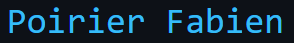

# 💫 About ME 

- 🎓 I am a PHD on Machine learning and Deep learning technology.
- 💻 I work on anomalies detection in videos and object detection.
- 🌱 I do some personal project on my community [@override community](https://github.com/override-community)
-    I speak french, spanish and some english.
- 📧 To contact me <a href="mailto:fpoirier03@univ-paris8.fr">fpoirier03@univ-paris8.fr</a>
- 🛠️ For more information visit <a href="https://fab16bsb.github.io/index.html" style="cursor:help"> my personal page </a>

  

  

   
  
   

# 💻 Tech Stack:
 

 

 
 
 

 
 
 

# 📊 GitHub Stats:
 
 

# 🏆 GitHub Trophies

# 🔝 Top Contributed Repo

<picture>
  <source media="(prefers-color-scheme: dark)" srcset="https://raw.githubusercontent.com/Fab16BSB/Fab16BSB/output/github-snake-dark.svg" />
  <source media="(prefers-color-scheme: light)" srcset="https://raw.githubusercontent.com/Fab16BSB/Fab16BSB/output/github-snake.svg" />
  
</picture>

# 🔗 Connect with me

  
  
  

