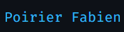

<h1> About ME </h1>  

     
  

- 🎓 I am a PHD student on Machine learning and Deep learning technology.
- 💻 I work on anomalies detection in videos and object detection.
- 🌱 I do some personal project on my community [@override community](https://github.com/override-community)
-    I speak french, spanish and some english.
- 📧 To contact me <a href="mailto:fpoirier03@univ-paris8.fr">fpoirier03@univ-paris8.fr</a>
- 🛠️ For more information visit <a href="https://fab16bsb.github.io/index.html" style="cursor:help"> my personal page </a>

  

  

   
  
   

<h2> Stats </h2>

<table>
  <tr class="noborder">
    <td>
      
    </td>
    <td>
      
    </td>                      
   </tr>
</table>

<table align="center">
  <tr class="noborder">
    <td>
       
    </td>
  </tr>
</table>

<table>
  <tr class="noborder">
    <td>
       
    </td>
  </tr>
</table>

<h2> Connect with me </h2>

  
  
    

